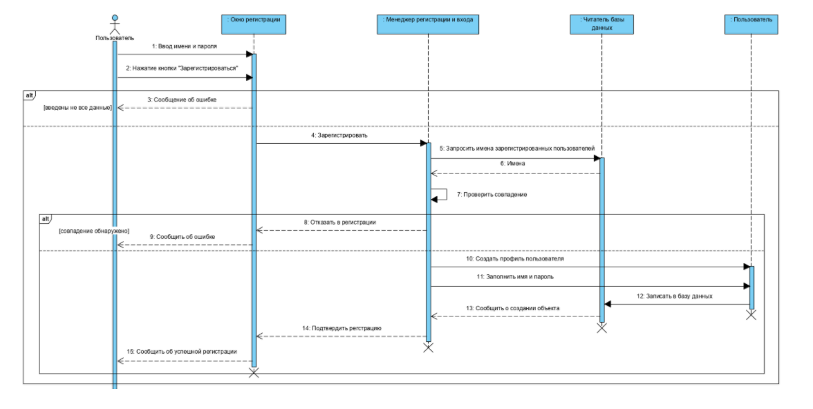
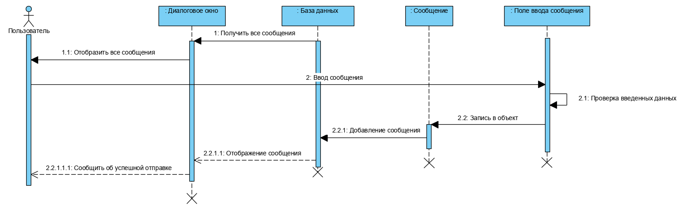

# Диаграммы последовательностей
---

# Содержание
1 [Зарегистрироваться](#reg)  
2 [Войти в учётную запись](#login)  
3 [Написать сообщение](#add)

<a name="reg"/>

# 1 Зарегистрироваться

<a name="login"/>

# 2 Войти в учётную запись

<a name="add"/>

# 3 Написать сообщение 

