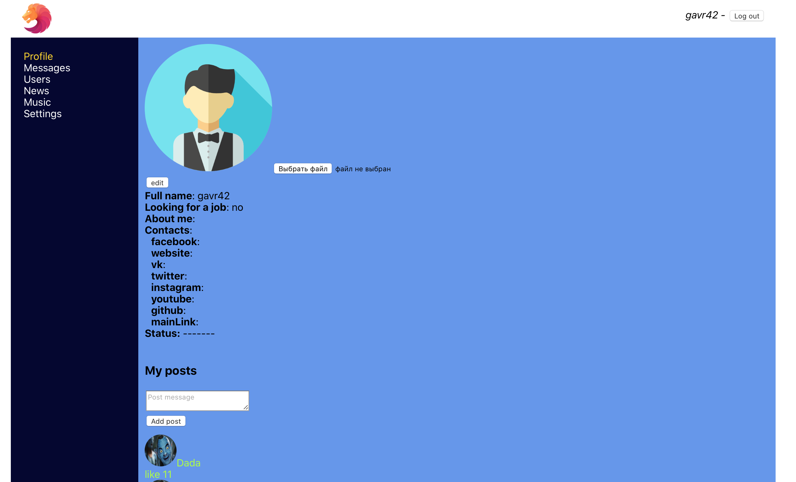
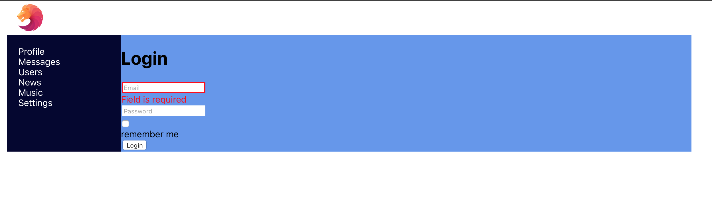
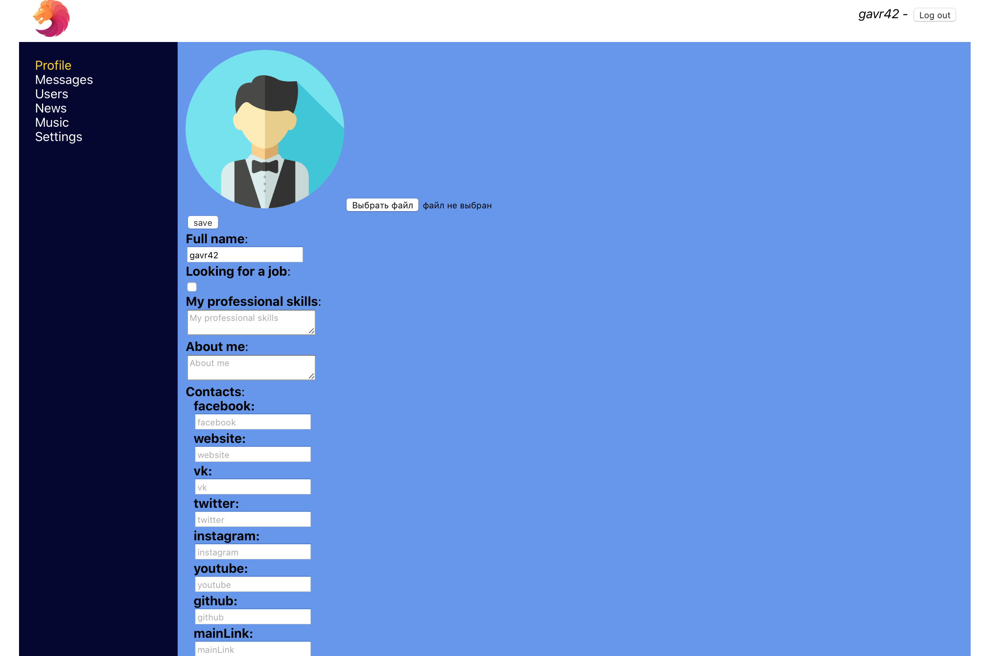
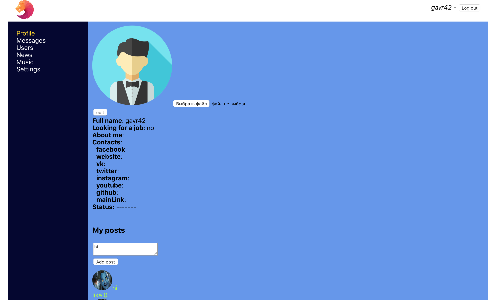
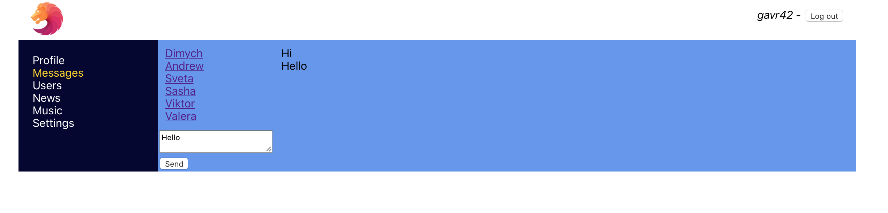
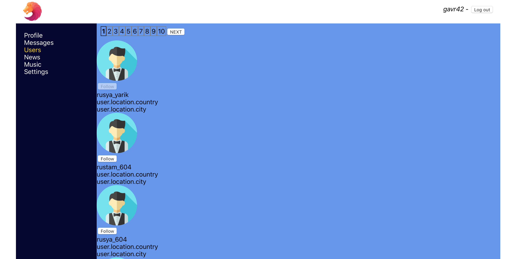

# Представление результатов

| ID | Назначение/название | Сценарий | Ожидаемый результат | Фактический результат | Оценка |
|:---:|:---:|:---|:---|:---|:---|
| 1 | Регистрация нового аккаунта пользователя | 1. Перейдите по адресу сайта на главную страницу.  2. Нажмите кнопку "Зарегистрироваться".  3. На открывшейся странице введите имя пользователя и пароль. 4. Нажмите кнопку "Зарегистрироваться".| Произошло перенаправление на главную страницу сайта. |  |  |
| 2 | Регистрация уже сущестующего аккаунта пользователя | 1. Перейдите по адресу сайта на главную страницу .  2. Нажмите кнопку "Зарегистрироваться".  3. На открывшейся странице введите имя пользователя и пароль, уже сущестующего аккаунта в системе. 4. Нажмите кнопку "Зарегистрироваться".| Появилось сообщение на странице с уведомлением о том, что данное имя уже занято. |  |  |
| 3 | Вход в зарегистрированный аккаунт | 1. Перейдите по адресу сайта на главную страницу .  2. Нажмите кнопку "Войти".  3. На открывшейся странице введите имя пользователя и пароль, уже сущестующего аккаунта в системе. 4. Нажмите кнопку "Войти".| Произошло перенаправление на страницу редактора аккаунта . |  |  |
| 4 | Добавление нового поста | 1. Выполните сценарий 3.  2. Введите текст.  3. Нажмите кнопку "Добавить".| Пост появился на главной странице. |  |  |
| 5 | Изменение данных вашего профиля| 1. Выполните сценарий 3.  2. Нажмите кнопку "Изменить".  3. На открывшейся странице произведите замену данных. 4. Нажмите кнопку "Сохранить".| На главной странице данные о вашем профиле изменились. |  |  |
| 6 | Добавление нового сообщения | 1. Выполните сценарий 3.  2.Введите текст.  4. Нажмите кнопку "Отправить".| На странице появится сообщение, которое вы ввели о отправили. |  |  |
| 7 | Добавление друзей | 1. Выполните сценарий 3. 2.На дразице друзей выберите подходящего вам человека. 3. Нажмите кнопку "Подписаться".|В вашем профиле появится новый друг,на которого вы подписались. |  |  |
|  |  |  |  |  |  |

# Иллюстрации

<a name="1"/>

Рисунок 1.

<a name="2"/>

Рисунок 2.

<a name="3"/>

Рисунок 3.

<a name="4"/>

Рисунок 4.

<a name="5"/>

Рисунок 5.

<a name="6"/>

Рисунок 6.

